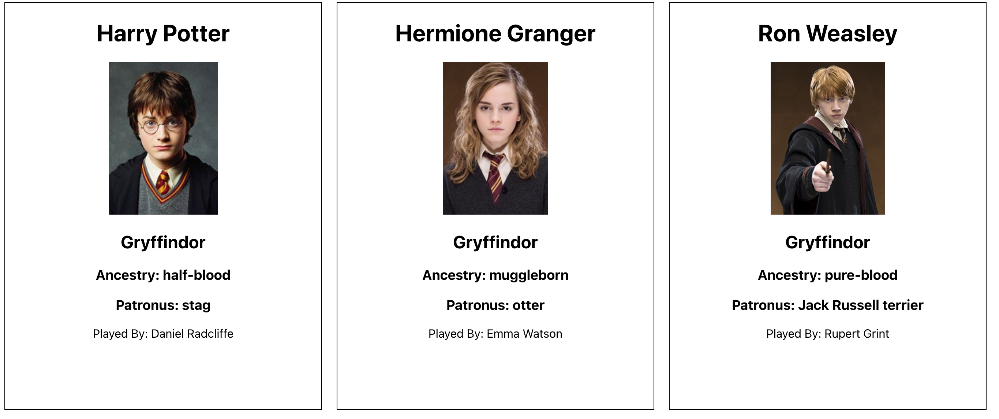

# Welcome to the Harry Potter Challenge

This is a challenge for Nology Students created by Rob Hooper

## Instructions

Use the data file provided to create character cards for the characters of the famous film 'Harry Potter'

We expect to see the following:

* Passing Props
* Passing Props through multiple levels
* Mapping the data array
* Appropriate styling
* Prop destructuring
* BEM naming convention
* The use of the Character container
* The use of the CharacterCard component

### Bonus

* Filter the array to only include characters with images
* Have fun!! What can you create!? Multiple sections for the students of each house? 
* Use this repo as a place to practice what we are learning about
* Can we add state to this project?

### API
* Once you have learnt how to use useEffect and Fetch, use the api below instead of the data file.
* https://hp-api.herokuapp.com/

### Example of a VERY basic character card grid

